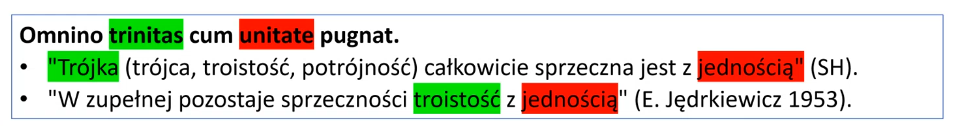
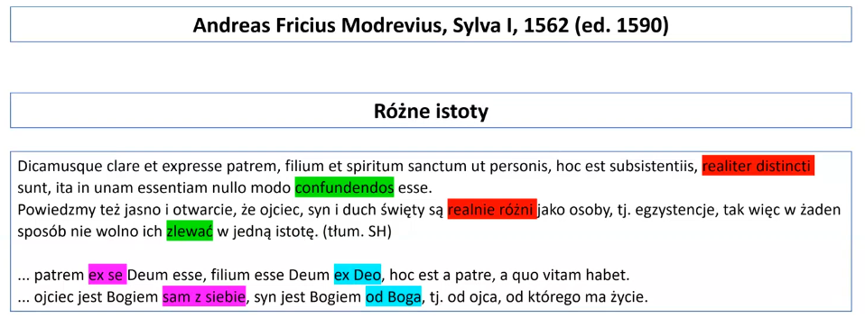

# Filozofia Polska -- wykłady

## Wykład 1 -- 11.03

Nazwy podzielone na trzy grupy

- pierwsza grupa ma walor naukowy
    - antytrynitarze -- największa wartość. Ci, którzy przeciwstawiają się 
    dogmatowi o Trójcy Świętej. Jeśli mówimy o ścisłej teologii, to jest ok, 
    natomiast jeśli mówimy o filozofii, to ich horyzonty były o wiele szersze. 
    Zajmowali się szerzej hermeneutyką, klasycznymi problemami ontologii, 
    fizyką, tworzyli koncepcje etyczne (kierunek racjonalizmu, humanizmu). Ta 
    nazwa jest dość elegancka, ale jest to tylko jedna cecha.
    - radykalna reformacja -- odejście od akcentu na Trójcę. Z drugiej strony 
    oni sami się odłączyli od ruchów Kalwinistycznych, byli przez nich 
    zwalczani. Wada tej nazwy dotyczy skupienia się na kwestiach wyznaniowych, 
    lepiej byłoby mówić o radykalnym humanizmie
    - unitarianie -- próba określenia na czym polegała pozytywna doktryna. 
    Unitarianie, jedność, Trójca błędnym odczytaniem. Jest jeden Bóg, pozostałe 
    dwie tzw. Osoby Boskie są czym innym. Ta nazwa oddaje pozytywne sedno 
    doktrynalne, ale to dotyczy późniejszej fazy rozwoju; po drugie znowu 
    zapomina się o stronie filozoficznej (dyteiści -- uznają dwóch bogów, Duch 
    Święty metaforą, która nie wskazuje na Boga; tryteiści -- są Osoby Boskie, 
    które są substancjami, ale mówimy o trzech bogach, a nie o jednym)
    - socynianie -- odnosi się do Socyna, najważniejszych postaci, które 
    konsolidowały ten obóz
    - Bracia Polscy
    - Pińczowianie
    - Rakowanie -- centrum ruchu przez pewien czas staje się Raków
- druga grupa
    - Chrześcijanie -- tak o sobie mówili, akcent na to, że nikt nie powinien 
    być wykluczony
- trzecia grupa -- od postaci
    - arianie -- Arius już wątpił w Trójcę, sami członkowie tę nazwę odrzucali 
    i słusznie, bo podłoże jest zupełnie inne, niż Ariusa, podobnie 
    z podostałymi postaciami

- ten sam kontekst, w którym powstała filozofia Machiavellego
- migracja do Szwajcarii, wytworzenie się swobodnej atmosfery intelektualnej. 
Badania także filologiczne. Także refleksja nad łaciną, którą użyto do 
tłumaczenia Biblii. Przeciwstawienie się twierdzeniu katolików, że łaciński 
przekład Biblii (vulgar ta) jest doskonały. Najpierw wsparcie Kalwina, ale później 
zwalczanie przez niego ruchu
- Czechy, ... -- wiele poglądów, które nie składały się na spójną linię. Próba 
konsolidacji przez Sozziniego
- migracja do Amsterdamu -- tam wybrała się filozoficzna śmietanka

- krytyka wszelkich wyznań, które uznają, że mają rację
- krytyka konfesjonalizmu (wyznanie najważniejszą postacią przynależności do 
wspólnoty politycznej). Antytrynitarze trzymali się ogólnych zasad obywatelskości
- wszelkie złożone sprawy teologiczne są problemem uniwersyteckim
- próba ujęcia od strony teologicznej

- filozofia ma się łączyć z teologią, ale zupełnie inaczej, niż w scholastyce. 
W scholastyce filozofia ma służyć teologii, po czym się wycofać i zostawić pole 
teologom. Filozofia wycofując się pozwala działać teologom tak, jak działa małpa 
z brzytwą. Teologowie nie uznają problemów, które są nieredukowalne. Za szybko 
tworzą oni doktryny i dogmaty
- filozofia ma odzyskać kontrolę, teologia ma być pod filozofią
- odzyskujemy to, co w etyce było ważne dla Arystotelesa -- praktycyzm. Etyka ma 
się zaczynać nie od pojęć, ale od doświadczenia życiowego.

- dzisiaj uważa się te teksty za prehistorię badań

- Reformacja w Polsce -- pismo, które powstały zaraz po odzyskaniu przez Polską 
niepodległości

- Cantimori -- najpierw sympatie faszystowski, później zdecydowanie się z tego 
wycofuje. Książka *Heretycy włoscy szesnastego wieku* -- tutaj mamy o Polakach, 
którzy przedostawali się do Szwajcarii. Syntetyczne opracowanie tej historii

- badania po wojnie
- braci polskich starano się podciągnąć pod myśl komunistyczną (przez władzę)
- w dyskursie jest to wentyl pozwalający znaleźć powiązania Polski z myślą 
europejską

- Servet zadarł z Kalwinem, który konsolidował swoją władzę jako polityk; 
skrytykował to oraz błędy doktrynalne
- główna teza: wykazanie, że teologowie mogą się mylić
- krytyka silnego predystynacjonizmu Kalwina
- trzy osoby boskie modusami
- opozycja wobec Kalwina i wszelkiego konfesjonalizmu
- spalony przez Kalwina na stosie

- subordynacjonizm -- Chrystus i Duch Święty są podporządkowani Bogu. 
podporządkowanie oznacza odrębność

- bardzo ważna postać w Polsce
- Chrystus mediatorem, nie ma statusu Boga. Mówiąc, że Chrystus jest boski, 
możemy myśleć o retorycznym zabiegu (szczęśliwy, racjonalny, piękny moralnie), 
nie można mówić o tym w znaczeniu filozoficznie pojętej substancji
- atak na kalwinizm
- Trójca może istnieć, ale od strony chrystologicznej mamy tu do czynienia 
z czymś zupełnie innym
- Trójca i jedność przedstawiane jako trudność. Antytrynitaryzm ma początek 
w analizie dogmatu. Przekonanie, że ważniejsza jest jedność.

- podejście, które ma korzenie przez jego wuja w ruchu humanistycznym. Jest on 
raczej organizatorem koncepcji, niż jej twórcą
- *Explicatio...*:
    - egzegeza Biblii ma się opierać na hermeneutyce w obrębie Biblii. Uznanie 
    różnych źródeł tekstów biblijnych. Ma to wykluczyć użycie terminów używanych 
    *ex post*. Pismo samo się tłumaczy
    - sens wyjaśniany w ramach tekstu
    - muneryzm -- działanie, ale nie substancja Chrystusa
    - bogate instrumentarium filologiczne
- mamy prawo do własnych przekonań, ale nie mamy prawa do tkwienia we własnych 
przekonaniach, trzeba je ciągle rozwijać
- przekonanie, że nie można nikogo zmuszać do przekonań
- sumienie gwarantuje także prawo do błądzenia

## Wykład 2 -- 18.03.

28:00 -- tutaj zaczynam notować

- Śmierć Serveta jedyną taką *głośną*, którą chwalił się Kalwin
- W Genewie kamień, który go upamiętnia. Spotkanie wolnomyślicieli, którzy 
chcieli go upamiętnić. Rok przed konferencją odsłonięty pomnik.
- Teskt napisany przez jedną z pierwszą kobiet profesor na uniwersytetach
- Dyskusja, czy był to błąd Kalwina, zakorzeniony w jego doktrynie? Czy da się 
powiedzieć, że to błąd czasów, błąd ciąży na całym okresie.
    - Luteranizm nie znajdowałby się w takim położeniu, bo ma skrzydło religijne 
    i kulturalne.
    - W kalwinizmie założyciel centralną postacią. Jeśli tu błąd, to błąd 
    w całej doktrynie. Ta dyskusja będzie się toczyć przez cały XX wiek.
    - Dzisiaj już kalwiniści mówią, że Kalwin popełnił błąd, ale dojście do tego 
    było całym procesem.

- W 1908 r. dodano, że spalenie Serveta na stosie nastąpiło na rozkaz Kalwina. 
Wcześniej został *zdalnie* spalony także przez inkwizycję katolicką.
- W 1942 r. marionetkowy rząd Vichy zniszczył pomnik, odbudowany.

- Tekst napisany w konwencji Machiavellego.
- Chłodna analiza, że porządek polityczny -- owszem -- jest związany 
z religijnością, że religia jest ważnym aspektem życia politycznego, ale nie 
wiadomo do końca co to znaczy. *Religio*, czyli wytrwałość. Nawet jeśli należy 
to powiązać z jakimś kultem, to z jakim?
- Castellion mówi o heretykach, wyróżnia wszelakie ich rodzaje. Zaznacza, że nie 
należy stosować przemocy.
    - *Nie mam śmiałości gwałcić swojego sumienia, bo nie chcę obrażać 
    Chrystusa, który przez św. Pawła powiedział, że nie mam robić czegokolwiek 
    oczym wątpię, czy jest słuszne. To, o czym ja wątpię, czy jest słuszne, jest 
    związane z relacą do drugiego obywatela. (...) Mam się posługiwać swoją 
    wiarą, a nie wiarą drugiego obywatela, który żyje obok.*
    - Wiara kwestą indywidualną, wręcz prywatną.
    - *Jeśli Kalwin hełpi się tym, że zabił Serveta, to nie oznacza to, że zabił 
    heretyka. Znaczy to tyle, że zabił człowieka.*

### Dyskusja na czacie

Definicja współsubstancjalności:

- Współsubstancjalność - dzielenie tej samej substancji (w sensie jakościowym)
- Współsubstancjalność czyli jedna natura, trzy osoby, czyli reprezentacje 
jednego Boga
- W ujęciu teologicznym pogląd, że trzy osoby boskie mają tę samą substancję 
równocześnie będąc innymi osobami
- Jedna substancja trzech osób boskich
- Element tej samej substancji jest obecny w Bogu, Chrystusie i Duchu Świętym. 
Np. istnieje coś takiego, jak boska substancja i ona jest obecna w każdym 
z pośród trójcy świętej
- Osoby Boskie są hipostazami jednej substancji

Argumenty przeciw:

- Dlaczego jedna substancja podejmuje z samą sobą dialog, sama się płodzi, 
wysyła się na krzyż i tak dalej... Osobiście uważam, że "problem" ten jest 
w ogóle istotny tylko dla chrześcijan a i tak nie wszystkich.
- Odniesienie do Boga Ojca oraz jego syna, Jezusa - silna dyferencjacja osób 
boskich, wprowadzenie hierarchii
- Przy założeniu, że substancja jest jedna, a osoby trzy zakładamy równocześnie, 
że substancja nie jest elementem dominującym (bo pozwala przy tym na tak silną 
odrębność)
- W Chrystusie unia hipostatyczna i obecność dwóch natur - ludzkiej i boskiej 
może sugerować jakąś odrębność jakościową osoby Chrystusa

Argumenty za:

- Porównanie do trzech stanów wody
- Dosyć dobre rozwiązanie problemu jedności trzech osób. Jedna substancja, trzy 
przejawy, ja problemu nie widzę, objawianie się przez różne jakości jednej 
rzeczy
- Dzieki temu Boskosc przekracza bariery substancjalnosci
- Bóg przekracza liczbę, liczba nie jest kresem

### Argumenty Serveta:

- Przyjmuje, że Jezus jest człowiekiem, Synem Bożym, Bogiem
    - Pismo Święte mówi, że zmarł, zmartwychwstał, jest więc człowiekiem
    - Biblia mówi, że jest Synem Bożym, nie ma co do tego sporu
    - Czy jest Bogiem? Tu już potrzebne instrumenty filozoficzne. Jest Bogiem, 
    o ile apostoł mówi, że jest w gatunku Boga. chrystusa z Bogiem łączy 
    gatunek. Połowanie się na Tertuliana (racjonalizm mistyczny): Chrystus jest 
    Bogiem jeśli chodzi o Jego formę, tą formą jest cnota (*virtus*), 
    doskonałość boska. Ciałem człowiekiem, Duchem Bogiem. Servet zauważa, że 
    można niedoceniać ludzkiej natury Chrystusa i robić z Niego tylko 
    i wyłącznie Boga.
- Chrystus istnieje w formie Boga.
- Mamy przyjąć *modalistyczną* wersję. Metafora wody -- jedna substancja, 
3 sposoby objawiania się. Jest to udany kompromis między racjonalnością, która 
posługuje się pojęciami; z drugiej strony mamy prostotę przekazu biblijnego. 
Przez racjonalność mamy przejść, aby skończyć na prostocie przekazu biblijnego.

- Pisma łączą elementy regilii, filozofii i fizjologii.
- Krwioobieg paradygmatem życia, także życia Chrystusa.
- Cytat po hebrajsku i grecku: *I nastała wojna w niebiosach*
- *Pierwszym duchem jest krew, która ma siedzibę w wątrobie i naczyniach 
krwionośnych. Drugi duch ma siedzibę w sercu. Trzeci duch, który jest światłem, 
jego miejscem jest mózg. Tak skonstruowany jest człowiek. Krąży tutaj krew (ten 
duch) między organami. Ten duch jest materialny. W nim jest dusza. Zbawienie 
duszy może mieć aspekty materialne.*
- To mistyczne ujęcie nie będzie potem kontynuowane przez antytrynitarzy 
polskich

## Wykład 3 -- 25.03.

Temat, który wiąże się z tym, co się będzie działo w Polsce. Wielu przeciwników 
antytrynitarzy kojarzyło właśnie z tymi tekstami, które dzisiaj. 

W centrum uwagi Erazm, ale wcześniej **Lorenzo da Valla** -- humanista XV 
wieczny, który pojawia się też jako pomysłodawca antytrynitaryzmu. Jest 
autorytetem dla wszystkich, którzy wprowadzają metody krytyczne. Związek między 
filozofią i teologią ma być nowy. Nie taki, jak w starej scholastyce, ale też 
nie taki, jak w nowej scholastyce (w szkołach jezuickich).

Antytrynitarze mają inne spojrzenie na filozofię -- nie jest ona dla nich 
instrumentarium, z którego można korzystać w apologii religijnej. U Melanchtona 
jeszcze filozofia jest uznana za coś, co może bronić jasno określonych poglądów 
religijnych. Początek XV wieku -- nowe podejście. Grupa teologów, którzy nie 
widzą siebie w roli krytyków czy heretyków, którzy filozofię chcą przywrócić 
jako autonomiczny obszar myśli, gdzie to filozofowie decydują jak używane są 
instrumenty filozoficzne. Z punktu widzenia teologów, jeśli na to pozwolimy to 
tracimy kontrolę nad tym, o czym się rozmawia -- nie da się przewidzieć 
konsekwencji tego. Szczególnie szkodliwi wydają się sceptycy wyćwiczeni 
w wskazywaniu paradoksów pojawiających się w doktrynach religijnych.

Ci, którzy rozwijają myśl krytyczną, nie chcą zniszczyć teologii. Da Valla 
i Erazm chcieli być teologami, ale chcieli wykorzystać w pełni krytyczny 
potencjał filozofii. Nie jest to tylko sceptycyzm starożytny, który szuka 
paradoksów albo tego, że chcąc coś udowodnić już na początku to zakładamy. 
Sięgają po nowe instrumentarium: filologia, literatura, retoryka. Retoryka 
przestaje być dodatkiem, staje się niezależną, w pełni rozwiniętą medotą 
naukową. Jeśli retoryka daje werdykt, to ten werdykt ma taką wartość, jak 
*porządnie* wypracowany argument teologiczny.

Da Valla: pismo, które pełni rolę zaczynu tego procesu.

Zauważmy, że to papież siedzi na tronie, zajmuje wyższą pozycę. Ta scena ma 
symbolizować przekazanie całej władzy imperialnej na ręcej głowy Kościoła 
katolickiego. Mowa jest o zakresie geograficznym -- wszystko, co podlega władzy 
Konstantyna, przechodzi pod władanie papieża.

Prowadzenie konia to zadanie dla niewolnika. Mamy samoponiżenie cesarze.

Dokument, który miał zostać wystawiony przez Konstantyna. Mamy tam spisane 
punkty, które na freskach widzimy symbolicznie. Wyznanie wiary, Konstantyn, 
który całe życie prześladował chrześcijan, na końcu życia przez poniechanie 
zabójstwa dzieci ukazuje mu się św. Piotr, który ma mu kazać pójść do papieża. 
Tam się ochrzcił, ten chrzest wyleczył go z choroby i nawrócił na bardzo głęboką 
wiarę.

Argumentacja, że dochodzi do niebezpiecznego pomieszania porządków. Kuzańczyk 
widzi coś groźnego w tym, że władza duchowa i świecka tak mieszają się w tym 
procesie.

Valla publikuje obszerne, trudne w odbiorze, dzieło, które opiera się na 
analizach językowych. Pokazuje, że i odniesienia historyczne są błędne. 
Pokazanie, że styl językowy to coś więcej, niż dodatek do myśli. Uderza to 
w średniowieczną wiarę, że słowa mają określone znaczenia, które mają silne 
odniesienia ontologiczne -- wszystko, co dzieje się na płaszczyźnie literackiej 
jest dodatkiem, natomiast reszta jest dodatkiem. Valla pokazuje, że słowa są 
w pewnych kontekstach używane inaczej -- są tak samo zmienne, jak cała kultura. 
Co więcej, możemy przez analizę słów stwierdzić z jakiego okresu, z jakiej 
kultury pochodzi dane dzieło.

Wnioski obu: ten dokument jest fałszywy.

Jeden wniosek: filologizacja wiedzy. Z drugiej strony stopniowe odchodzenie od 
figury autorytetu. Autorytet dokumentu polegał na tym, że doszło (na przestrzeni 
kilku wieków) do głębokiego zakorzenienia w prawie tych argumentów. Przywiązanie 
do nazwiska człowieka, który używał kiedyż pewnego argumentu. To są dwa procesy.

Czasem nawet ci, którzy byli krytykami, często albo sami powoływali się na 
autorytety, albo chcieli autorytetami zostać. To są powolne procesy.

Kuzańczyk tworzy po soborze w Konstancji, który zniósł dwa ośrodki papiestwa. 
Ten sobór budził nadzieję na zniesienie schizmy pomiędzy chrześcijaństwem 
zachodnim i wschodnim, ale także ich strukturą polityczną. Historycy zwracają 
uwagę, że gdybywtedy problemy zostały rozwiązane, to jest szansa, że nie 
mielibyśmy reformacji.

### Erazm z Roterdamu

Bliska przyjaźń z Tomaszem Morusem (utopia polityczna jako mechanizm analizy). 
Erazm umysłem politycznym, pisze teksty polemiczne, teoretyczne. Do głosu 
dochodzi u niego jasna świadomość polityczna, jakie konsekwencje ma to dla 
porządku politycznego.

De libero arbitrio -- o wolnej woli (odpowiedź na zniewoloną wolę Lutra). Erazm 
jako obrońca wolnej woli.

*Comma* po grecku oznacza wstawienie czegoś do tekstu. Mamy coś, co okazuje się 
dodatkiem do oryginalnego tekstu Pisma Świętego.

Ten tekst zawiera tę pełniejszą, niesprawdzoną wersję.

Ten stan oddaje biblistykę od czasów nowożytnych. Teraz jest już bardzo mało 
ludzi, którzy trwają przy *Comma Johanneum*.

Mamy do czynienia z próbą stworzenia tekstu równoległego do prologu Ewangelii 
św. Jana. Erazm doszedł do wniosku, że to jest wstawienie nowego elementu, jest 
to interpolacja.

Erazm opublikował równoległe wersje Nowego Testamentu. Mamy krótszą wersję bez 
*Comma Johanneum*. Wersja Nestle Aland przyjęła praktycznie słowo w słowo to, co 
Erazm opublikował w roku 1519. 1522 r. Erazm przywraca *Comma Johanneum*, aby 
uniknąć oburzenia i zachować wpływy. Nie idzie to linearnie, postęp się cofa, 
pojawia i tak to się toczy.

Jakie jest tego znaczenie dla antytrynitarzy? Znika bardzo ważne, koronne 
potwierdzenie w tekście biblijnym. Stąd droga dla tekstów Socyna. Około roku 
1580 Socyn usuwa wszystkie tego typu miejsca z redakcji Biblii i z dyskusji 
teologicznych. Do dzisiaj uznane jest, że w tekstach Nowego Testamentu żadna 
metafora biblijna nie pozwala na bezpośrednie połączenie języka biblijnego 
z językiem naukowej teologii, która mówi o Trójcy. Jeśli teologia mówi o trójcy, 
to na 100% posługuje się językiem niebiblijnym, późniejszym, filozoficznym. 
Teologowie posługują się językiem filozoficznym, nie mają żadnego oparcia 
w Biblii.

Ten cytat uchodzi za najbardziej filozoficzny w całej Biblii (może z wyjątkiem 
samego początku Księgi Rodzaju). Język łaciński nie używa rodzajników, nie 
będzie tu przydatny. Właśnie o rodzajnik będzie spór.

W tekście czerwonym w grece nie występuje rodzajnik. Polszczyzna nie 
odzwierciedla tego.

Tło: teoria Erazma oparta na paradygmecie, że retoryka to nie jest dodatek, to 
jest nauka o języku, a wszystko (w pewnym sensie) jest w języku. Retoryka 
o wyrazie *logos* mówi, że jest to wyraz wieloznaczny. W łacinie wiele możliwych 
tłumaczeń. To nie jest element, to jest wielość elementów w dynamicznych 
relacjach. Erazm szuka najlepszego sposobu przełożenia (nie negując tradycyjnego 
verbum, które wskazuje na pojedyncze słowo, ale zwraca się ku innym). To ma dać 
świadomość, że *logos* jest dynamiczny, co dla człowieka oznacza, że jego 
relacja z Chrystusem ma być dynamiczna. Należy uczyć się od Chrystusa, który 
jest nauczycielem i przykładem. Po drugie te rodzajniki wskazują na to, że 
*logos* jest absolutny. Dzięki temu, że jest wewnętrznie zdynamizowany 
i zróżnicowany. Bo Bóg jest wewnętrznie zdynamizowany i zróżnicowany. Nie należy 
przesadzać z metafizyką podkreślającą bosko-ludzką naturę, to jest niepewne 
i niepotrzebne praktycznie. W drugim punkcie dla Erazma *logos* jako Syn Boży ma 
charakter absolutny. Erazm nie zostaje antytrynitarzem.

Da Valla i Erazm źródłami nowych metod, paradygmatów. Dają nowe tropy myślenia 
antytrynatrzy. Bez nich nie byłoby polskiego antytrynitaryzmu. Jednak żaden 
z nich nie przeszedł na pozycje doktrynalne przedstawione póżniej przez Socyna. 
Z pism Erazma wiemy, że to, co Socyn powie za 50 lat, było już dla niego do 
przewidzenia, zaznaczał, że widzi jak do takich doktryn dotrzeć, ale to napawa 
go strachem i nie może do tego dotrzeć.

## Wykład 4 -- 01.04.

Dzisiaj sprawa *wolnej woli*. Jest to pojęcie złudne -- dzisiaj temat jest 
bardzo szeroko omawiany przez filozofię analityczną. Żeby wejść w tę tematykę 
tak, jak była ona rozumiana wtedy, to musimy się odłączyć od współczesnego 
podejścia.

Dzisiaj to jest rozumiane jako wolny wybór, natomiast we współczesnej filozofii 
padają pytania takie jak *co to znaczy, że ktoś może zdecydować inaczej?*, *czy 
podjęta decyzja jest wypadkową warunków?*.

W XVI wieku nie pytano o determinizm w podejmowaniu codziennych decyzji. Wtedy 
ta kwestia wiąże się nierozerwalnie z grzechem pierworodnym (perspektywa 
teologiczna) i perspektywą zbawienia. Mamy wtedy stanowisko Augustiańskie (tylko 
łaska), Tomistyczne (łaska, ale czyny mają znaczenie dla zbawienia), stanowisko 
Erazma (wolność człowieka jest ważniejsza, niż grzech pierworodny, który być 
może nawet nie ma znaczenia).

Tyle z uwag wstępnych.

Pelagiusz to to samo pokolenie, co Augustyn. Pelagiusz optymistą 
antropologicznym. Natura człowieka z gruntu rzeczy dobra. Krytyka manicheizmu, 
ale doktryna samego Augustyna okazuje się przeszyta maniheizmem.

Maniheizm -- religia, słabo uporządkowana; mają w świecie istnieć dwie zasady: 
dobra i zła (to sprzeczne z myśleniem platońskim, które przyjmuje Augustyn, 
gdzie jest zasada dobra, zło brakiem dobra), człowieka od dołu ściąga zło, 
człowiek jest w rozterkach, nie jest do końca tożsamy ze sobą.

Zarówno Augustyn jak i Pelagiusz walczą z maniheizmem. Augustyn przez platonizm. 
Pelagiusz, jako asceta, oburzał się na niemoralność. Utrzymywał, że remedium na 
moralne zepsucie będzie przywrócenie wiary w dobrą naturę człowieka. Skoro 
człowiek został stworzony przez Boga, to i jego natura ma w sobie coś boskiego. 
Ta natura nigdy nie ginie. Ona przejawia się też w woli, w której platonicy 
widzą tylko zepsucie. To, co dobre, jest niezniszczalne. Jeśli natomiast chodzi 
o grzech pierworodny, to Adam zgrzeszył, ale odpowiedzialność za grzech musi być 
indywidualna, nie może to wpłynąć na naturę kolejnych ludzi tak, że rodzą się 
już z winą. Pelagiusz posuwa się do stwierdzenia, że w tym kontekście decyduje 
wola człowieka. Jeśli człowiek chce dobrze, to udało mu się nawiązać kontakt 
z dobrą stroną natury, jego zbawienie jest formalnością. Umniejszenie roli łaski 
-- Bóg nie potępi dobrego. Co więcej, Bóg nie musi ratować człowieka przez 
śmierć na krzyżu, ponieważ już go ratuje przez dobry przykład -- Adam zgrzeszył, 
Chrystus uczy nie grzeszenia. To stanowisko wywołuje bardzo zdecydowany sprzeciw 
Augustyna. Ostatecznie ekskomunika i potępienie nauk Pelagiusza.

Ostatecznie zwyciężył Augustyn. Jednak wpływ pelagiusza u humanistów jest 
obecny. Miał rację z krytyką Augustyna. Platonizm, który jest tak emocjonalny, 
barwny, jest bardziej zrospaczony, niż skuteczny. Pelagiański sprzeciw działa 
mocniej tam, gdzie ludzie są zainteresowani koncepcją, która uczy wolniści, każe 
szukać dobrego korzenia wolności w naturze człowieka. Stąd republiki, które nie 
są opanowane przez wąską grupę ludzi, otwierają się na szersze grupy obywateli, 
takie ustroje sprzyjają tendencji pelagiańskiej.

Dzisiaj Kościół określa się jako semi-pelagiański. Przyjmuje wolność, ale nie 
akceptuje konsekwencji, jaką jest nieistotność łaski.

Erazm publikuje teksty, z których wynika, że zbliża się do poglądów Pelagiusza. 
Luter zaczyna swoją doktrynę budować w kontrze do Erazma. To skończy sie mocnym 
konfliktem. Skupimy się na głównych tezach dwóch publikacji. Erazm pisze 
o wolnej woli, Luter o zniewolonej.

Erazm reaguje na dojrzałą koncepcję Lutra i na mocny nacisk, który luter kładzie 
na łaskę bożą. Erazm uznaje łaskę -- uważa, że jest potrzebna, ale nie można jej 
absolutyzować i nie można zgadzać się na to, by ona decydowała o losie człowieka 
w całości tylko dlatego, że ktoś czytał platoników i uwierzył, że wszystko, co 
cielesne, co nie jest czystym rozumem, jest samo w sobie grzeszne. Owszem, jest 
coś bardzo złego w naturze ludzkiej, jednak są w stanie poznać się na własnym 
złu. Jest sumienie, intuicja, refleksja moralna, jest wreszcie intelekt 
rozpatrujący konsekwencje naszych wyborów. Trzeba się strzec takiego 
odczytywania Biblii, które uznaje grzech pierworodny za samodzielną zasadę 
(czyli maniheizm), a nie tylko za tendencję. Analiza językowa ma nas ustrzec od 
takim odczytaniem, które przypisywałoby każdemu winę, która załuguje na karę. 
Wolna wola siłą, dzięki której człowiek może zwrócić się ku temu, co prowadzi do 
zbawienia, albo się od tego odwrócić. Jeśli wolna wola powoduje coś złego, to 
tylko wtedy, gdy człowiek w sposób świadomy, mając przed sobą możliwość 
zbawienia, odwraca się od niej i wybiera coś innego. Jeśli ktoś wybierze zło, to 
nie jest efekt natury ludzkiej jako takiej.

Co więc z takimi miejscami w Biblii, które dla większości teologów uchodzą za 
świadectwa substancjalistycznego determinizmu, który oznacza, że natura ludzka 
jest zepsuta. Co zrobić z tymi miejscami? Erazm argumentuje, że te miejsca nie 
dotyczą natury ludzkiej jako takiej, dotyczą raczej problemu boskiej 
przedwiedzy. Bóg wie z góry jakie są charaktery, moralne wybory ludzi. Wie to 
także w odniesieniu do przyszłości. Tak należy traktować te miejsca w Biblii.

Luter w odpowiedzi publikuje mocny tekst, który nie wchodzi jednak do kanonu 
luteranizmu. Nie udało się Lutrowi wprowadzić tej pozycji jako wiążącej do całej 
tradycji luterańskiej. Człowiek z własnej woli nie potrafi zbliżyć się do Boga, 
nie może czynić dobrych rzeczy w oczach Boga. Od grzechu pierworodnego natura 
ludzka jest tak zepsuta, zła, człowiek pozostawiony sam sobie może tylko 
grzeszyć. Jeśli robi cokolwiek dobrego, to już jest to działanie łaski bożej. 
Człowiek nie decyduje o swoim postępowaniu.

Polska szlachta koncepcji Lutra nie przyjmuje.

Tutaj spis najważniejszych tekstów.

- Polityczność to jest nic innego, niż realizujący się potencjał racjonalności 
człowieka (i na odwrót)
- Kiedy rzeczpospolita przestaje się reformować, przestaje istnieć
- Prawo najważniejszym instrumentem polityki, ale ono samo wyrasta z obyczajów. 
Trzeba do nich sięgać, jednocześnie eliminując to, co nasza racjonalność uznaje 
za zło.

Frycz mówi, że w praktyce społecznej trzeba się zachowywać tak, jak gdyby zło 
było osobną substancją. Nie ma tu czasu zachowywać się tak, jakby wszystko było 
brakiem dobra. Frycz nie umetafizycznia tej nauki. Nie przyjmuje tu 
jednoznacznego stanowiska, rozpatruje to jako problem filozoficzny, który ma 
swoją stronę praktyczną i teoretyczną. Odrywa się w nim erazmiańczyk.

Frycz zgadza się z Lutrem i Kalwinem, że upadek człowieka jest głęboki 
i zostawił ślad w naturze człowieka. Jak duży to ślad? Kalwin przyznaje, że 
rozum, o ile ma dobre warunki może dalece zajść, ale nie w kontekście wszystkich 
ludzi. U Kalwina ten sposób życia jest nie do pogodzenia z praktyką polityczną. 
Frycz mówi, że nie tylko rozum, ale też strona woluntatywna, zachowała w sobie 
coś dobrego po upadku człowieka. Człowiek nie tylko w rozumieniu czegoś dochodzi 
w końcu do cnoty, ale także i w chceniu. Nawet jeśli w grzechu pierworodnym jest 
jakaś siła, to nie przenika ona nawet całej strony woluntatywnej.

Wola jako wybór kierunku.

Frycz racjonalistą, dużo materiału z Cycerona. Proponuje takie pojęcie 
racjonalności, która jest w stanie przenikać nawet w to, co dzisiaj nazywamy 
podświadomością, tam działać. W tym sensie człowiek posiada wolną wolę. W woli, 
chceniu jest coś dobrego, w rozumie możliwość przejrzenia.

Frycz broni erazmiańskiego pojęcia wolności intelektualnej pokazując, że pozycje 
teologiczne (które stają się pozycjami politycznymi) są źle napisane od strony 
filozoficznej, bo ci ludzie nie panują nad pojęciami.

## Wykład 5 -- 08.04.

### Frycz Modrzewski

Tekst Frycza Modrzewskiego, który *słusznie* uchodzi za jeden 
z najtrudniejszych. Powstał on, ponieważ w Polsce pojawiały się coraz większe 
kontrowersje wokół antytrynitaryzmu, który rodzi się w XVI wieku jako już 
w miarę uchwytny obóz (bardzo mało zdyscyplinowany, zróżnicowany zewnętrznie, 
ale jednak z zewnątrz widoczny). Jeszcze nie zostało przez Socyna sformułowane 
stanowisko unitaryzmu (dwie kolejne osoby boskie czymś podobnym do Boga, ale nie 
są bogami). Tej pozycji jeszcze nie ma wtedy (lata 60-te, o tym mówimy), ale 
zaczynają się konflikty wokół tego.

Te konflikty nabierają wymiaru politycznego. Czas Synodu trydenckiego, walk 
politycznych (choćby ze względu na to, że Zygmunt August nie ma potomka). 
Królowi zależało na zażegnaniu konfliktu, na sformułowaniu doktryny, która 
rozwiąże to politycznie, albo chociaż złagodzi to teologicznie. Padło na Frycza 
Modrzewskiego, który był rozeznany w argumentach, miał kontakty, z drugiej 
strony Modrzewski miał pewien posłuch wśród obu obozów (katolickiego 
i protestanckiego), nadawał się na arbitra.

Frycz się podjął, napisał cztery teksty, które dotyczą problemu 
antytrynitaryzmu. W drugim tekście kolejne przedstawienie kościoła narodowego na 
modłę angielską. Polski kościół, w którym każdy znajduje schronienie, formuła 
kompromisowa.

Reakcja na skomplikowanie, inna na prostotę. Aspekty, które wyrażają się 
w różnicy między z jednej strony intellectus (wrażliwej na to, co za pojęciami, 
na idee, jedność, intuicja intelektualna reagująca na to, co proste, patrząca na 
to, co kryje się za pojęciami), z drugiej strony ratio (od słowa *liczyć*, to 
już zakłada wielość elementów, ta strona radzi sobie ze skomplikowanymi 
strukturami, hierarchiami). Klasyczny schemat, który jest teraz przykładany do 
różnych spraw.

Jeśli tekst Frycza ma jednoznaczną odpowiedź, to jest jakaś strona prosta 
(intuicja), oraz jakiś proces, który jest szalenie skomplikowany. Pomysł Frycza 
polega na tym, żeby zadbać o formuły oddające tę prostotę i następnie ją 
zostawiają -- zostawiają pewne elementy ludziom do własnego osądu, do własnego 
przeżywania religijnego, żeby przy tym już nie *majstrować*. Prostota Biblii (o 
którą trzeba zadbać i ją przekazywać), z drugiej strony cała patrologia 
(działalność ojców Kościoła), mnóstwo konfliktów -- tym niech się zajmują ci, 
którzy panują nad pojęciami, krórzy są biegli filozoficznie -- im trzeba dać 
wolność (ponieważ jest ona niegroźna społecznie i politycznie jeśli pamiętamy 
o różnicy między prostotą i skomplikowaniem).

Cztery *sylwy* jako nieuporządkowany tekst, który zawiera ciemne, skomplikowane, 
niekanoniczne rzeczy. Akt wydania tego przez antytrynitarze przez wielu jest 
dowodem na to, że Frycz miał przejść na stronę antytrynitarzy. Jednak trzeba 
pamiętać o kontekście. Kiedy Frycz to pisze, to:

- obóz nie jest jeszcze skonsolidowany
- Frycz wielokrotnie wyraża przywiązanie do tradycyjnej teologii; to, co go 
zbliża do antytrynitarzy to nie jest stanowisko teologiczne tylko metoda 
filozoficzna, podejście do różnych tekstów z instrumentarium erazmiańskim 
i sprawdzanie przede wszystkim rodzaju tekstu: to sprawia, że inaczej czytamy 
Biblię, inaczej filozofię a jeszcze inaczej tradycję patrologiczną. W tym leży 
największe podobieństwo Frycza i antytrynitarzy.

Dlaczego tekst został wydrukowany dopiero w 1590 roku (około 20 lat po 
powstaniu). Frycz chciał to wydać wcześniej, złożył to w drukarni w Bazylei (w 
Polsce drukować nie można tego było, bo w kraju za duża była otwartość na 
antytrynitarzy) -- z drukarni manuskrypt został wykradziony przez kalwińskich 
teologów i agentów, których doszły słuchy o dyskusjach w Polsce; chciano mieć 
gotową odpowiedź, najlepiej już wydrukowaną, w momencie, w którym wydrukowane 
zostanie problematyczne stanowisko. Jeszcze lepiej, jeśli mamy wydrukowaną 
odpowiedź i jednocześnie możemy zapobiec wydrukowi (tak się stało). Wykradziono 
manuskrypt, przygotowano odpowiedź, która pokazuje jak ważna jest płaszczyzna 
metodologiczna.

Ta odpowiedź w sprawach czysto doktrynalnych się od stanowiska Frycza nie 
różniła, ale różniła się co do metody -- była ona dokładnie odwrócona. Język 
jest jeden, słowa mają zawsze jedno znaczenie, bez względu na to, czy pochodzą 
one z kontekstu biblijnego, filozoficznego czy teologicznego. To było podejście 
autora -- było ono niesamowicie popularne. To pokazuje z jak ważną sprawą mamy 
do czynienia, jak osobliwe jest stanowisko Frycza i antytrynitarzy co do języka.

Teraz zobaczymy jak to jest zbudowane. 4 sywy. Pierwsza i czwarta o istocie 
i osobach Boga. Pierwsza składa się z trzech traktaków.

Autor planuje prowadzić nas przez manowce. Gdy zobaczymy, że te tezy się nie 
sklejają, nie powstaje rozwiązanie, to mamy w to nie wchodzić, nie doszukiwać 
się rozwiązania. Raczej traktować to doświadczenie jako aporie. Jako moment, 
w którym doświadczamy, że czegoś nie wiemy. Świadomość swojej niewiedzy jest 
początkiem nowej drogi. Pójście na dystans i zadanie sobie pytania *co mogę 
robić alternatywnego, skoro pojęcia nie chcą się ze sobą zgadzać?* Mogę się 
skupiać na prostocie, złożeniu.

Jak budowane są kolejne traktaty? Jeden broni tezy, że mamy do czynienia 
z trzema osobami i jedną istotą, drugi będzie stał za tym, że mamy trzy istoty, 
trzeci będzie to rozważał całościowo.

Pierwszy traktat:

- rozpoczęcie od wyjaśniania pojęć (tu widać erazmiańskie podejście do języka)
- lista argumentów z Biblii na rzecz tej tezy 34 -- trzy osoby, jedna istota; 
przeprowadzenie analizy językowej -- dojście do wniosku, że źle zostały 
odczytane te fragmenty, nie zgadza się to z teologią
- argument, który prawdopodobnie jest jego osobistym poglądem -- to ma na celu 
zbicie tendencji, które wówczas są najbardziej wyraźne -- dyteizm i tryteizm, 
rezygnacja ze wspólnej istoty i radykalna teza, że skoro trzy osoby, to trzy 
istoty, trzy substancje, trójka bogów -- to stara się Frycz zbić

Drugi traktat:

- tu już nie ma analizy języka
- punkt, w którym wydaje się bardzo sensowne mówienie, że skoro trzy osoby, to 
trzy istoty, jednak Frycz pokazuje, że ta teza jednocześnie ma w sobie jakąś 
rację, ale jednocześnie jej nie ma -- wyczucie sensownego środka

Trzeci traktat:

- zderzenie obu stron
- rozbudowane analizy dotyczące Chrystusa i Ducha Św.
- mowa końcowa, w której Frycz powraca do erazmiaństkiego motywu prostoty 
i złożenia; respektowania granicy między jednym a drugim

#### Wybrane motywy z pierwszego traktatu:

- podjęcie argumentacji antytrynitarzy

- Mamy dwa różne motywy
    - Jest pewna forma gramatyczna *trinitas*, która oznacza zamiast *trzy* coś 
    takiego jak *troistość*, *potrójność*; to samo możemy robić z każdą inną 
    liczbą -- to jest pewien banał językowy, który jeszcze nic nie znaczy. Mamy 
    trzy Osoby, ale przecież jest jeszcze pojęcie Boga i istoty boskiej -- 
    w pewnych pismach pojawia się problem poczwórności, mamy trzy osoby i naturę 
    boską. To wskazuje na to, że kto chce mówić o trójcy musi się zmagać, że 
    jeśli chcemy mieć trzy elementy w jedności, to jest szansa, że ta jedność 
    będzie czwartym elementem. To są problemy tradycyjnie występujące 
    w patrologii
    - Cytat św. Jana. To jest Comma Johanneum w bardzo ciekawej formie. Frycz 
    (uczeń Erazma) przywraca Comma Johanneum, tak jak Erazm, kiedy okazało się, 
    że usunięcie wywołuje bardzo duże emocje. Frycz pisze, że *trzy są, którzy 
    dają świadectwo w Niebie: Ojciec, Logos, Duch Św.* Mowa jest w przekładzie 
    SH. Jest tu *sermo* a nie *verbum* osiągając pewną tekstowość w hereneutyce. 
    Wiara nie w stałe znaczenie słowa, a wiara w wielość relacji w ramach 
    jednego tekstu, ale też z innymi tekstami
- Część języka antytrynitarzy i część języka tradycyjnej trynitologii (ale 
z erazmiańskim *sermo*) -- szukamy kompromisu
- Analiza kończy się problematycznym stwierdzeniem

- Trójka **zawsze**, mocno sprzeczna -- dosłownie *walczy* z jednością -- ten 
argument traktowany z bardzo dużą uwagą
- Ta sprzeczność jest gdzieś na poziomie filozoficznych pojęć. Na tym tle musimy 
rozumieć kolejny krok Frycza

- Tu najbardziej osobliwy argument Frycza
- Jeśli mówimy o Biblii, to musimy się zastanowić nad pojęciami, które są 
używane w samej Biblii, ale też o tych pojęciach, które są używane, kiedy mówimy 
o samej Biblii
- Frycz przebadał grecką wersję Nowego i Starego Testamentu (co do Nowego to 
oryginał, co do Starego to przekład, którego według legendy dokonało 70 
tłumaczy, każdy z nich miał otrzymać ten sam tekst). Ta cała rozbudowana 
terminologia ontologiczna, terminologia dotycząca bycia, w ogóle w Biblii nie 
występuje. Jest jedno miejsce, gdzie słowo *być* jest stosowane w mocnym 
znaczeniu, jako pełny czasownik, jako czynność. To jedyne miejsce, to słynne 
*jestem, który jest*. Cała reszta jest dodatkiem filozofów i teologów.
- Frycz twierdzi, że istota i bycie, to jest jedno w kontekście Biblii. Frycz 
stawiając tutaj znak równości odżegnuje się **całkowicie** od tradycji 
arystotelesowskiej. U Arystotelesa być a być tym, czym się było, to przepaść. 
Frycz stawia znak równości, ponieważ przyjmuje zasadniczą różnicę między Biblią 
i jakąkolwiek filozofią. Istota i bycie różnią się tylko drobnymi dodatkami 
gramatycznymi, które nie mają żadnego znaczenia dla znaczenia.
- W drugim etapie okazuje się, że wszystkie poniższe określenia (natura, istota, 
osoba, istnienie, hipostaza, podmiot, ...) to jest to samo, co bycie.

- Kierunek krytyki ślepego utożsamiania języka filozofii z językiem Biblii.
- Argument 12-sty zaczerpnięty z pism jednego teologów.
- W ewangelii Jana mamy zdanie: *zanim Abraham stał się, ja jestem* -- Chrystus. 
Jestem stanowi tu mocne istnienie. Chodzi o akt bycia.
- Abrahamowi akt istnienia przypisany przez czasownik oznaczający *powstawanie* 
(w domyśle *i ginięcie*). Z drugiej strony *einai*, *być* jako wieczne 
bytowanie. Być bo ktoś nie może inaczej. To jest konieczne, odwieczne, wieczne 
bycie. Frycz mówi, że tutaj ten argument upada, ponieważ jest to stosowanie 
języka filozofii do języka biblijnego. To jest przykład tego, jak Frycz 
krytykuje nadużycia w interpretacji Biblii

Teraz kolejny argument (16), który się ostoi, można go chyba interpretować jako 
osobiste przekonanie Frycza:

- Z natury, a nie z adopcji bądź ze względu na pełniony przez siebie urząd, 
Chrystus nazywany jest Synem Bożym. Więc jest On Synem Boga. W takim sensie, 
w jakim dzieci pochodzą od swoich ojców. Jedna jest ich substancja, jedna 
władza, jedna godność. Jest więc Bóg jeden ze swą substancją, choć ma trzy 
osoby.
- Czytelnik mógłby odetchnąć z ulgą. 34 dowody biblijne nie działają, ale główna 
teza o Trójcy jest obroniona. Tak, ale tak się kończy tylko pierwszy traktat -- 
jest też drugi. Musimy się liczyć z tym, że to, co Frycz tu mówi jest częścią 
aporycznego doświadczenia. Celem, byśmy doświadczali różnych tendencji i ich 
niezgodności.

#### Drugi traktat

Będzie mowa o trzech osobach, ale jednocześnie trzech istotach

- Istota to nic innego, jak osoba. Jeśli więc mamy trzy osoby, to mamy i trzy 
istoty
- Frycz od razu prezentuje stanowisko łagodne. Można wyczytać tendencje do 
kompromisu
- Tradycja prawosławna w tym temacie nie odchodzi tak daleko od tekstu 
biblijnego, ponieważ nie idzie za filozofią
- Na zachodzie podkreślano bardziej równorzędność Ojca i Syna w akcie stworzenia 
świata. Świat jest z Ojca i Syna -- oni są wtedy zbliżeni do siebie, prawie 
równolegli. To jest stanowisko, którego w XV wieku nie mogli akceptować 
prawosławni, którzy pisali, że świat jest stworzony z Ojca **przez** Syna. 
Z Ojca, ale Syn jest transmiterem. Syn pośredniczy między Bogiem a stworzeniem. 
Tego sporu nie udało się rozwiązać.
- Ten spór w Królestwie Polskim i Wielkim Księstwie Litewskim nie rodził nigdy 
większych napięć politycznych. Frycz to wykorzystuje. Sięga po doświadczenie 
prawosławia. To się tutaj zaznacza
- *Realnie różni* -- to jest język filozoficzny. Spór o różnicę realną. Jeśli 
mam butelkę, szklankę i długopis, to jest między nimi różnica realna.
- Ojciec i Syn są różni jako egzystencje (język filozoficzny, w Biblii nie ma 
tej różnicy), nie można ich zlewać w jedną istotę. Nie wolno nam trzech rzeczy 
rozmywać w jednej istocie, skoro są one realnie różne. Jednak Frycz używa tu 
pewnego czasownika: *confundendos* -- oznacza to wlewać trzy płyny do jednego 
naczynia tak, żeby nie było różnicy. *Confundere* jest czynnością, której 
dokonujemy my, ludzie czytający ten tekst. Ten akt polega na tym, że stoimy 
przed trzema realnie różnymi rzeczami. Widzimy to, ale na siłę szukalibyśmy 
metody zniesienia tej różnicy i stwierdzenia, że mają one jedną istotę.
- Ta teza Frycza nie oznacza, że mamy radykalnie wykluczyć jedność tych trzech 
rzeczy, która bez naszego udziału, naszej tendencji psychologicznej, aby coś 
łączyć na siłę, samoistnie z czegoś wynika. Tu będzie Frycz szukać rozwiązania. 
Na razie w tym drugim traktacie musimy stwierdzić, że jeśli nawet mówimy o Synu, 
że jest Bogiem, to w innym sensie, niż Ojciec, który jest Bogiem sam w sobie. 
Syn jest Bogiem z Boga -- on swoją boskość ma nadaną przez Ojca.
- Furtka zostawiona -- tej współistotności nie można rozumieć tak, jaką 
mielibyśmy tendencję psychiczną -- jako przymus, by na siłę połączyć i rozmyć 
różnicę między rzeczami -- ta różnica musi być zachowana. Frycz zachowuje ją 
tak, że jest to zaproszenie na poziomie językowym do tego, by korzystać 
z tradycji prawosławnej, która jest mniej arystotelesowska. Ona się nie wikła 
w różnice między istotą a istnieniem. Tam jest Proklos, Aeropagita, Plotyn, 
Platon. Na tym też będzie polegało to, co Frycz proponuje jako rozwiązanie.

Kolejyn argument:

- Osoby mają w Biblii różne nazwy, tylko do Ojca stosuje się w Biblii takie 
określenia, które wskazują na Jego źródłowość. On jest źródłem, prakorzeniem, 
zasadą, początkiem, ... . Gdybyśmy to chcieli zastosować do Syna, to gdyby Syn 
miał te atrybuty, to byłby własnym Ojcem.

- Tu mamy polskie rozwiązanie europejskiego problemu. Dzięki wielości kultur 
mamy tutaj pewną elastyczność w podejściu do biblijnych obrazów.
- *Zdmuchana*, bo to słowo to oddech. Zdmuchać z trzech różnych kierunków.
- Istotę należy rozumieć tak, że została ona udzielona **z** Ojca (jako ze 
źródła, z Jego głębi)
- Jeśli mamy taki obraz, płynięcie w naszą stronę a nie wtłaczanie przez nas 
w jedność, to w takim sensie Frycz zgadza się na Trójcę.
- Nie można pomyśleć istoty Syna i Ducha bez odniesienia do Ojca. Zabieg 
neoplatoński.

#### Traktat trzeci

- Zaproponowane pojęcie *emanatio*. Trudno powiedzieć w jakimkolwiek żyjącym 
języku co to jest emanacja.
- Źródło wydając z siebie niczego z siebie nie traci.
- Różnica między istotą słońca a istotą promienia może być dobrze tłumaczone 
przez instrumentarium szkotystyczne. Światło jest jedno a drugie takie samo. 
Jednak jest różnica -- w promieniu jest światło od słońca, ale już w innym 
miejscu. W tym sensie Trójca jest i trójcy nie ma. Współistotność jest 
i współistotności nie ma. Tak jak między słońcem i jego promieniem.

## Wykład 6 -- 22.04.

Dzisiaj temat gorąco dyskutowany na początku historii antytrynitaryzmu, ale 
będziemy go obserwować po zakończeniu tej historii. Pod koniec XVII wieku 
dyskutowano o ontologii i epistemologii po teorii zbudowanej przez Leibniza.

Próba uchwycenia dyskusji, która kiedy w XVII wieku filozofia ma wielu 
filozofów, na których dorobku może się opierać. Warto zauważyć problem, który 
się otwiera w dyskusji XVI wieku, ponieważ to napędza filozofię wieku XVII.

Chodzi o **Chrystologię**

### Chrystologia

Franciszek Stancar, który rozpętał namiętną dyskusję w Rzeczpospolitej, krajach 
niemieckojęzycznych. To są te ciosy, które spowodują pęknięcie w obozie 
kalwinistów i wytworzenie szkoły antytrynitarskiej. 

#### Wstępne uwagi:

- Pamiętamy decyzję Frycza Modrzewskiego, aby w interpretacji tekstów biblijnych 
wstrzymywać się od zróżnicowań filozoficznych we wspólnej terminologii, która 
łączy pojęcia z trzech obszarów:
    - tekstu samej Biblii
    - filozofia, które odpowiada za terminologię ontologiczną
    - teologia, która odnosi się do biblii i nie wyczuwa różnicy między teologią 
    a dyskursem biblijny; teraz sięga jeszcze po instrumenty filozoficzne 
    roszcząc sobie prawo do wyższości nad filozofią
- Frycz chce oddzielenia tych trzech sfer -- tam, gdzie dyskusja wychodzi od 
Biblii, to należy odstąpić od języka filozoficznego, ponieważ w Biblii nie jest 
on używany
- W tle tej całej dyskusji mamy też konkurujące paradygmaty ontologiczne. XVI 
wiek czerpie z dorobku średniowiecza. Renesans nie oznacza zerwania z nim. 
Renesans oznacza odejście od autorytetów i odkrywanie na nowo dorobku 
średniowiecznego. Odkrywa się go głównie w dwóch kierunkach:
    - kierunek tomistyczny
    - schemat Szkota -- bycie, które jest przedstawione jako ogarniające 
    przeciwności (na przykład między przemijającym i wiecznym, niedoskonałym 
    i doskonałym) dopiero połączenie obu połówek pozwala nam myśleć o byciu jako 
    pewnej całości
- Listy Stanisława Orzechowskiego pokazujące nowy kierunek w filozofii -- miał 
połączyć na nowo filozofię z Tomaszem, co ważne, odejście od łaciny

#### Spór Stancara

Spór o trzech Osobach boskich -- jak opisać ich jedność. Chrystus musi znaleźć 
swoje miejsce -- dyskusja zaczyna się się od *subordycjanizmu* 
(podporządkowanie) -- w ramach Trójcy mamy ważniejsze i mniej ważne osoby. 
Rozwój ontologii w późniejszym czasie, który ma swoje korzenie u Szkota -- żeby 
nie rozbić jedności Trójcy można w pewnych granicach pojmować osoby nie jako 
osobne substancje, osoby, byty; lecz jako aspekty, sposoby funkcjonowania, 
modusy oddziaływania. Relacyjne aspekty -- to jest *modalizm*, on staje się 
w pewnym momencie dość popularny. Modalizm nawet dzisiaj odgrywa pewną rolę. Tym 
zasłużyli się antytrynitarze, że wymusili filozoficzne opracowanie myślenia 
modalistycznego, które były obecne w myśli średniowiecznej.

Sami antytrynitarze wywierali nacisk przez to, że kiedy odkryli te metody 
modalistyczne, to przeszli na twarde pozycje porzucające trynitologię. Zaczęli 
mówić o dwóch bogach, następnie pojawia się tryteizm, czyli przywrócenie Ducha 
Świętego jako Boga, czyli mamy do czynienia z trzeba odrębnymi bogami. Od Socyna 
faza unitaryzmu -- tylko Bóg Ojciec jest Bogiem, Jezus człowiekiem z pewnymi 
metaforycznymi cechami boskimi, Duch Św. bez statusu boskiego.

Chrystologia może być traktowana jako część Trynitologii. Jednak trynitologia 
nie zajmuje się wewnętrzną kondycją każdej z tych osób -- na dalszym planie 
pytanie o to, kim właściwie jest ta Osoba -- to nie jest punkt ciężkości 
trynitologii, jednak w odniesieniu do Chrystusa takie rozważania muszą się 
pojawić. Jest to człowiek urodzony i żyjący na tej ziemi, nie posiadający tak po 
prostu wiecznego żywota, ponieważ został zabity. W centrum następujące pytanie: 
Jeśli jest człowiekiem, to czy może być również Bogiem -- czy to się nie 
wyklucza? Możemy wykluczyć któryś aspekt, na przykład aspekt ludzki i kłaść 
nacisk na wymiar boski (Stancaro), można w drugą stronę (późniejsi 
antytrynitarze, którzy redukują element boskości).

Mamy postać, która ma być i człowiekiem i Bogiem. Kiedy mamy dyskurs, który ma 
to uporządkować, to pojawia się problem.

Jak w ogóle możemy rozumieć to, że człowiek-Bóg jest w jednej osobie? Gdzie 
sięgnąć, po jakie formuły argumenty, obrazy? Pomysły uczestników wykładu.

- przykład gąbki i wody -- gąbka nasączona służy do czego innego, niż gąbka 
sucha -- jest tu nowa jakość
- człowiek-Bóg to symbol -- to jest podobne do stanowiska antytrynitarzy, to 
jest pewna opowieść, pewien symbol

Jakie pojęcia filozoficzne mają z tym jakiś związek?

- problem uniwersaliów -- ani za pomocą instrumentów średniowiecznych, ani 
renesansowych (literackich, hermeneutycznych, filologicznych) nie da się tego 
problemu rozwiązać; pojęcie Boga jako *universale*, pokusa, by traktować pojęcie 
*Boga* podobnie, jak traktujemy pojęcie człowieka, konia, domu -- jako 
określenie pewnej *klasy bytów*; to prowadzi do paradoksu: Bóg jest jeden, ale 
jeśli to ma być powszechnik, to zakładamy jakąś wielość
- transcendencja
- Pierwszy Poruszyciel
- jedność i wielość -- czym jest jedność, czym jest wielość, czy każda wielość 
jest taka sama, czy każda wielość oznacza, że nie ma jedności, czy mamy takie 
formy wielości, które nie kwestionują jedności, czy mamy takie jedności, które 
wskutek pojawienia się wielości ulegają rozwiązaniu i inne, które nie ulegają

#### Koncepcja Stancara

Stanacr stawia problem na pewnej płaszczyźnie, na której to będzie dyskutowane 
przez następne 100-150 lat.

Francesco Stancaro urodzony na początku XVI wieku w północnych Włoszech. Ma 
barwną biografię. Kilka miejsc, w których przebywał. W wieku 30-stu lat 
opublikował gramatykę hebrajską -- język hebrajski daje nowe dojście do Starego 
Testamentu -- to nie pozostaje bez skutków dla ontologii. Do tego czasu przekład 
grecki, ale głównie vulgata.

Powiązał się z reformacją. Aresztowany przez Wenecję. Pobyt w Szwajcarii -- tu 
panuje tolerancja. W Wiedniu otrzymał profesurę w zakresie hebrajszczyzny, 
jednak z Wiednia musiał wyjechać, ponieważ miasto było katolickie, a tam 
zorientowano się, że Stancaro ma pewne pomysły teologiczne. Następnie Niemcy -- 
rozmowy międzywyznaniowe.

Podróż na wschód -- najpierw Siedmiogród, później Kraków, gdzie otrzymał 
profesurę w zakresie języka hebrajskiego i studiów nad Starym Testamentem. Tu 
trafił do aresztu, ponieważ czołowy przedstawiciel reformacji katolickiej 
zorientował się co do jego pomysłów. Potem Pińczów. Wyjeżdża z Polski 
i przyjmuje profesurę w Królewcu -- tam dochodzi do sporu związanego z pewnym 
profesorem, który to spór dotyczy tryteizmu i tendencji subordynacjonistycznej. 
Dalsza podróż do Siedmiogrodu, później znowu do Polski -- tu jako stary człowiek 
spędził ostatnie 10 lat życia.

Bardzo dużo pisał o Starym Testamencie, fascynował się kwestią Mesjasza w Nowym 
i Starym Testamencie -- pytanie o tożsamość -- czy mamy do czynienia z jednym, 
czy z dwoma Mesjaszami. Jego odpowiedź -- jest jeden Mesjasz 
starotestamentowo-nowotestamentowy pod względem działalności w niebie, natomiast 
na ziemi jest różność -- jeden w Starym, jeden w Nowym.

Praca chrystologiczna -- najważniejszy druk ukazuje się w Krakowie. *O Trójcy 
i pośredniku naszym -- Jezusie Chrystusie -- przeciwko Bulingerowi* -- czołowemu 
teologowi kalwińskiemu.

Argumenty Stancara

To jest końcówka pracy. Dzieło pełne bezpośrednich ataków na Kalwina.

To jest wynik tej dyskusji.

Fragment z pierwszej części analizy -- uznanie podwójnej natury Chrystusa 
i wyciągnięcie z tego konsekwencji.

Chrystus ma dwie wole -- jedną boską i drugą ludzką. Tak samo posiada dwie 
naturalne operacje -- sposoby działania. Inaczej działa jako Bóg, inaczej jako 
człowiek, ale to wszystko w Jezusie.

Przejście do trynitologii -- jeśli jest jakaś boska natura w Chrystusie, to musi 
ona być (w odróżnieniu od ludzkiej) wspólna Jemu i Ojcu. Jeśli tę naturę możemy 
nazwać substancją/istotą, to możemy mówić o współistotności. Dość klasyczne 
stanowisko w trynitologii.

Natura ludzka się pojawia z Nim na ziemi i znika, gdy on umiera. Ma ludzką 
naturę, którą przyjął nie od Boga, tylko od ludzi.

Modalistyczna wersja trynitologii, lecz motyw dwóch natur w Chrystusie 
zrewolucjonizowany do końca -- przełożony na psychologię (wola jako instancja 
duszy -- wola musi być podwójna, zgodnie z dwoma naturami), różne sposoby 
działania. Sam Stancaro nie rozwija do końca tej myśli. Wnioski będą wyciągać 
autorzy zgromadzeni wokół Socyna (pojawi się konsekwencja, iż Jezus był 
człowiekiem w szczególnej relacji z Bogiem i to tyle).

Arystoteles -- tekst, który już przez kilkaset lat uchodzi za podstawę 
wykształcenia uniwersyteckiego: *Kategorie*, komentarz Boecjusza. Tekst, który 
rozpoczyna drogę do fizyki i metafizykik od kategorii językowych.

1. Stosunek -- pewna wzajemność, relacja. To, co jest podwójne nie jest połową.
2. Przeciwieństwo -- w nim wyraża się mocniejsza tendencja, nie stosunek 
matematyczny czy pojęciowy, ale tendencja, by jedno i drugie ujmować jako 
samodzielne zasady, które działają. Zło i dobro przeciwne sobie -- nie wystarcza 
powiedzieć, ze zło to tylko brak dobra, to jest w punkcie 3.
3. Brak i posiadanie -- ślepota opisana po prostu jako brak wzroku.
4. Twierdzenie i przeczenie -- siedzi, nie siedzi -- mówimy o jednym i tym samym 
bycie w jednym i tym samym czasie. Jeśli mówimy o tym samym pod tym samym 
względem, to nie możemy mówić o tym samym, pod tym samym względem, że nie.

W 4 widzimy pewną tendencję, by od słabszych form przeciwstawiania się 
przechodzić do coraz mocniejszych. Mamy tendencję do wykluczenia drugiego, gdy 
zachodzi pierwsze.

Ad 1. Muszą być obecne obydwa elementy. W 4-ce tak nie jest -- tu albo siedzi, 
albo nie siedzi. Albo zapłacił, albo nie. Mówiąc najprościej albo jest, albo nie 
jest.

U Boecjusza przeciwstawianie to opozycja.

Zwróćmy uwagę na sformułowania Stancara. W tych wyrazach posługuje się on 
terminologią nie boecjuszowską, szuka w innych miejscach.

Najważniejszy wyraz *rozdzielone*. Jakie następstwo tezy, że mamy dwie natury? 
Jeśli mamy dwie istoty, to musimy też mówić, że mamy do czynienia z dwoma 
osobami, z dwoma subsystencjami, z dwiema rzeczami, jedno i drugie nie może się 
znajdować w obrębie jednej osoby, jest to wykluczone -- to jest stanowisko 
antytrynitarzy. Stancar nie przyjmuje takiego stanowiska, ale przyjmuje 
terminologię, która pozwala takie stanowisko sformułować podkreślając, że to, co 
jest oddzielone, rozdzielone, nie może być obecne w jednym jako natura. To jest 
punkt dojścia całej tej historii. Dokładnie o to rozpęta się dyskusja w XVII 
wieku -- czy to, co rozdzielone, jest również sprzeczne. I gdzie możemy określić 
stopień przeciwstawności między naturą boską a naturą ludzką w terminologii 
Arystotelesa. Nie ma jeszcze niezależności filozofii od religii.

